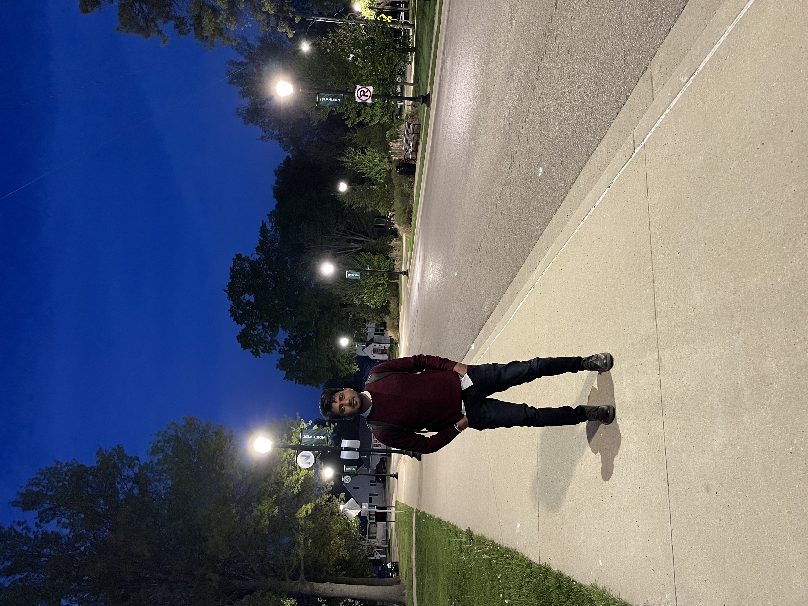

# Naresh Chityala
I completed my graduation in Mechanical Engineering.
with my intrest in computers i started my career as Software Engineer. To become a fullstack Developer am doing my MAsters in Computer Science. Coming to my hobbies I love Sketching, travelling and cooking.!

[Naresh Ch](pic.jpg)

 

---
### Sports Table


The following tables contains differnt types of sports, benifits of playing following Sports and average hours to play to be fit and healthy.

| Sport Name | Recommend Reason| Avg Hrs Per Week |
| --- | --- | ---: |
| Swimming | bsolutely stress-free, can be carried out no matter the season, improves lung capacity, burns calories, builds up muscles | 12 |
| Basketball | Increases spatial awareness, promotes decision-making, good stress reduction, supports coordination, very high energy consumption | 16 |
| Cycling | Good calorie burner, strengthens the brain and cardiovascular system and exercise in nature makes you happy| 15 |
| Running | Runners have fewer bone and muscle problems than non-runners of the same age, running releases endorphins, running improves both mental and physiological health | 18 |


---
### Pithy Quotes

> The only impossible thing is that which you believe to be not possible - ***Nambi Narayanan***


> If you want to shine like a sun, first burn like a sun - ***A. P. J. Abdul Kalam***

---

### Code Fencing

> Here's a relevant SVG question from Stack Overflow. Please click here to open it [SVG Link](https://stackoverflow.com/questions/72297012/im-trying-to-reference-an-image-in-a-svg-code-that-is-in-the-same-folder-that)

```
<svg>
  <ellipse class="ground" .../>
  <path class="kiwi" .../>
</svg>

```
Click the below link to find above code snippet from css-tricks: [https://css-tricks.com/using-svg/](https://css-tricks.com/using-svg/)


